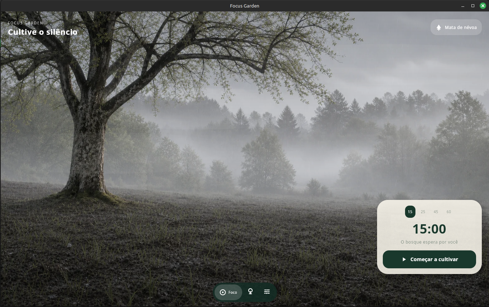

# Focus Garden 

Focus Garden é um temporizador de concentração multiplataforma. Durante cada sessão, a paisagem evolui gradualmente; ao concluir o tempo, o bosque é salvo no histórico local do usuário.

## 🌐 Live Demo

<p align="center">
  <a href="https://focus-garden-kmp.netlify.app">
    
  </a>
</p>

<p align="center">
  <strong>Kotlin Multiplatform · Compose Multiplatform · Android · Desktop · Web/Wasm</strong>
</p>

<p align="center">
  <a href="https://focus-garden-kmp.netlify.app">
    
  </a>
</p>

<p align="center">
  <em>Click the preview to try Focus Garden in your browser.</em>
</p>

O projeto compartilha interface, regras de negócio e recursos visuais entre navegador, Android e desktop.


## Funcionalidades

- Temporizador com durações rápidas de 15, 25, 45 e 60 minutos
- Duração padrão ajustável entre 5 e 120 minutos
- Ações de iniciar, pausar, continuar e recomeçar
- Quatro biomas: Mata de névoa, Vale das cerejeiras, Lago alpino e Planalto de outono
- Transição visual entre o estágio inicial e o estágio maduro de cada bioma
- Chuva, névoa, luz, folhas, pétalas e outros detalhes animados
- Seleção manual ou aleatória de bioma
- Histórico local das sessões concluídas
- Contagem de bosques, minutos de foco e sequência de dias
- Som opcional ao concluir uma sessão
- Ícones vetoriais desenhados diretamente com Compose Canvas
- Aplicação web instalável (PWA) e cache para funcionamento offline

## Tecnologias e versões

| Tecnologia | Uso | Versão |
| --- | --- | --- |
| Kotlin Multiplatform | Código compartilhado | 2.1.20 |
| Compose Multiplatform | Interface gráfica | 1.8.1 |
| Material 3 | Componentes e tema | fornecido pelo Compose |
| Kotlin Coroutines | Temporizador e animações assíncronas | 1.10.2 |
| Android Gradle Plugin | Compilação Android | 8.9.1 |
| AndroidX Activity Compose | Entrada da aplicação Android | 1.10.1 |
| AndroidX Core KTX | Integrações Android | 1.16.0 |
| Kotlin/Wasm | Execução no navegador | configurado pelo Kotlin 2.1.20 |
| Gradle Wrapper | Automação de build | 8.11.1 |
| JDK | Compilação JVM e Android | 17 |
| Python + Pillow | Preparação e otimização de imagens | versão compatível com Pillow atual |

## Plataformas

### Navegador

A versão web utiliza Kotlin/Wasm e gera uma aplicação executável no navegador. O histórico e os ajustes ficam no `localStorage`. O manifesto e o service worker permitem instalar o Focus Garden como PWA e acessar recursos já carregados mesmo sem conexão.

### Android

- Android mínimo: API 26 (Android 8)
- Android alvo e compilação: API 35
- Identificador: `dev.focusgarden.app`
- A conclusão usa `ToneGenerator` para emitir um toque curto quando o som está habilitado

### Desktop

A versão JVM usa Compose Desktop. O projeto está preparado para gerar pacotes DMG, MSI e DEB.

## Organização do código

```text
composeApp/src/
├── commonMain/
│   ├── kotlin/dev/focusgarden/app/
│   │   ├── App.kt             # Telas, navegação, controles e ícones
│   │   ├── Biome.kt           # Definições e cores dos biomas
│   │   ├── FocusSession.kt    # Estados e regras do temporizador
│   │   ├── GardenData.kt      # Histórico, ajustes e abstração de plataforma
│   │   └── LivingForest.kt    # Paisagens e efeitos animados
│   └── composeResources/
│       └── drawable/          # Paisagens WebP usadas pelo aplicativo
├── commonTest/                # Testes das regras e da persistência
├── androidMain/               # Entrada e integrações Android
├── desktopMain/               # Entrada e integrações desktop
└── wasmJsMain/                # Entrada web, PWA e localStorage
```

Outras pastas importantes:

```text
artwork/source-png/  # Imagens originais em PNG
scripts/             # Scripts de processamento visual
previews/            # Pré-visualizações animadas
gradle/wrapper/      # Gradle Wrapper do projeto
```

## Funcionamento do temporizador

`FocusSession` mantém a duração, o tempo restante e o estado atual:

- `Ready`: pronto para iniciar
- `Running`: contagem regressiva ativa
- `Paused`: contagem interrompida
- `Completed`: sessão concluída

A interface executa um ciclo a cada segundo enquanto a sessão está ativa. O progresso calculado controla a transição entre as imagens inicial e madura do bioma e a intensidade dos efeitos atmosféricos.

## Dados armazenados

O aplicativo não usa servidor ou banco de dados remoto. Os dados permanecem no dispositivo do usuário.

Na web, são utilizadas duas chaves no `localStorage`:

- `garden_records_v1`: até 200 sessões concluídas
- `garden_settings_v1`: bioma aleatório, som e duração padrão

Cada registro contém horário, dia, duração e bioma. Limpar os dados do site no navegador apaga esse histórico.

## Recursos visuais

Cada bioma possui duas imagens WebP: uma para o início da sessão e outra para a paisagem madura. O Compose sobrepõe as imagens e desenha efeitos procedurais com `Canvas`.

Os ícones da navegação, do cronômetro e dos biomas também são vetoriais e desenhados no código. Isso evita dependência de fontes de símbolos ou bibliotecas externas de ícones.

Scripts disponíveis:

- `scripts/optimize_landscapes.py`: converte os PNGs originais em WebP com Pillow
- `scripts/create_pwa_icons.py`: gera os ícones de 192 × 192 e 512 × 512 da PWA
- `scripts/create_ambient_preview.py`: cria uma prévia animada WebP do lago

## Executar no desktop

Pré-requisito: JDK 17.

```bash
./gradlew :composeApp:run
```

## Executar no Android

Abra a pasta no Android Studio, aguarde a sincronização do Gradle e execute a configuração `composeApp` em um emulador ou aparelho com Android 8 ou superior.

## Executar no navegador

Ambiente de desenvolvimento:

```bash
./gradlew :composeApp:wasmJsBrowserDevelopmentRun
```

Distribuição de produção:

```bash
./gradlew :composeApp:wasmJsBrowserDistribution
```

O resultado é criado em:

```text
composeApp/build/dist/wasmJs/productionExecutable/
```

## Publicar no Netlify

1. Gere a distribuição web de produção.
2. Compacte **o conteúdo** de `composeApp/build/dist/wasmJs/productionExecutable/` em um arquivo ZIP. O `index.html` deve ficar na raiz do ZIP.
3. Abra o site no painel do Netlify.
4. Entre em **Deploys** e envie o ZIP na área de deploy manual.
5. Após a publicação, faça uma atualização completa da página com `Ctrl + Shift + R`.

O arquivo `service-worker.js` usa um identificador de cache versionado. Esse valor deve ser incrementado quando for necessário invalidar uma versão já armazenada pelos navegadores.

## Testes

Execute os testes compartilhados no target desktop:

```bash
./gradlew :composeApp:desktopTest
```

Os testes cobrem o temporizador, a progressão da paisagem, as configurações, o histórico e o cálculo de sequência.

## Pacotes gerados

Arquivos `.zip`, `.tar.gz` e diretórios `build/` são artefatos de compilação ou publicação. Eles podem ser recriados a partir do código-fonte e não são necessários para editar o projeto.

## Licença

Este repositório ainda não possui um arquivo de licença. Antes de distribuir, aceitar contribuições ou permitir reutilização pública, adicione uma licença compatível com a finalidade do projeto.
